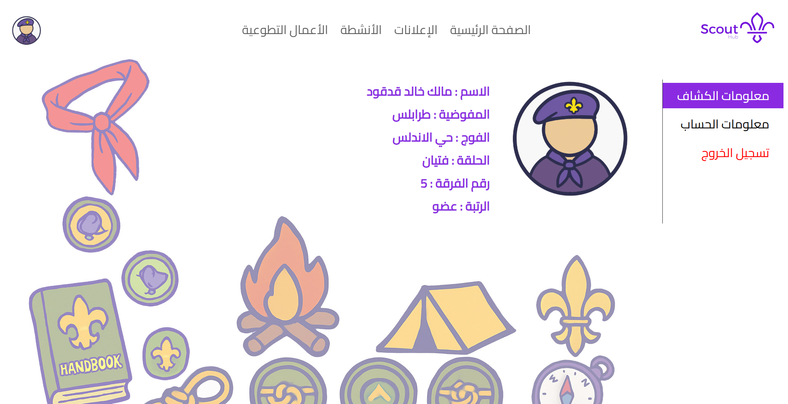

# Scout-Hub
This platform enables Scouts to efficiently organize and manage their events and volunteer activities.

# Users
- Leader
- Member

# Key Functionality
- Leader
    - Log-in
    - Sign-up
    - Announcements (View, Create, Update, Delete)
    - Event (View, Create, Update, Delete)
    - Volunteer Work (View, Create, Update, Delete)
    - Show Members Registered (Events, Volunteer Works)
- Member
    - Log-in
    - Sign-up
    - Announcement (View)
    - Event (View, Register, Cancel registration)
    - Volunteer Work (View, Register, Cancel registration)

# Screens

# DB Diagram

